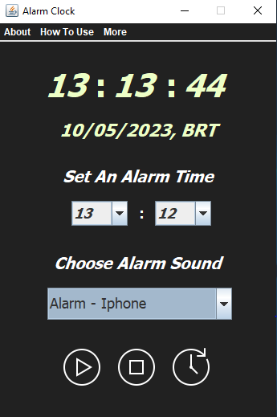

# Alarm Clock 2.0

</img>

## Requisitos: 

para usar qualquer aplicação java voçê precisa ter a 'JRE' Java Runtime Environment -> 'ambiente de execução java', instalada no seu computador!
usada para para executar as aplicações da plataforma Java. <a href="https://www.java.com/pt-BR/download/manual.jsp">DOWNLOAD JAVA JRE</a>

## Usar:

Se deseja apenas usar essa aplicação então baixe apenas o instalador <a href="https://github.com/jtas22/AlarmClock/blob/main/AlarmClock-V.20-Setup.exe">'AlarmClock-V.20-Setup.exe'</a>.
